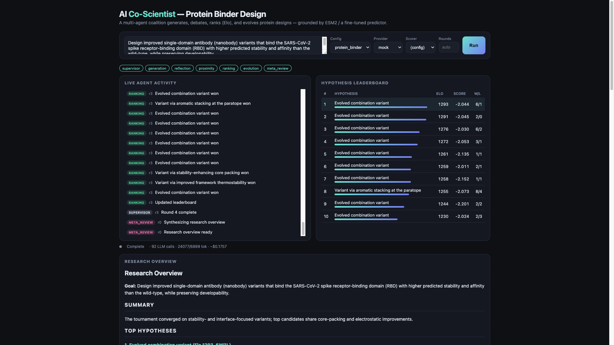
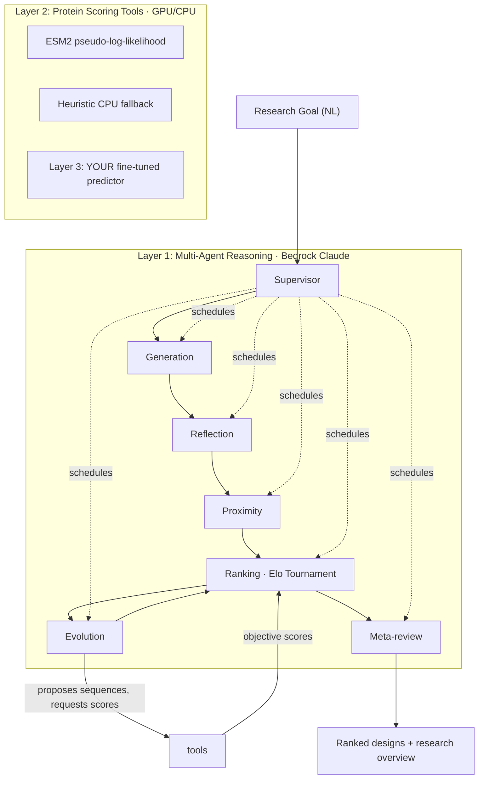
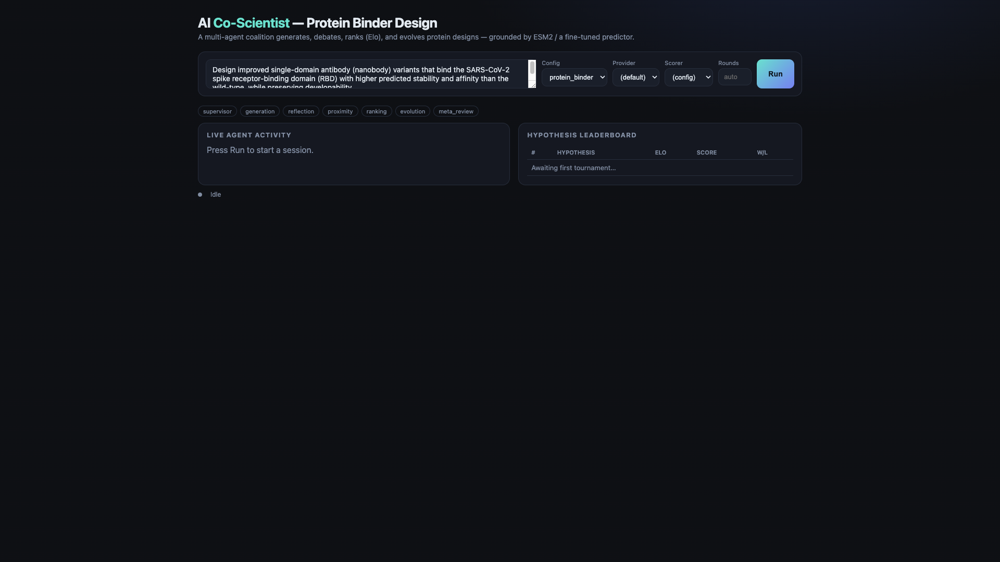
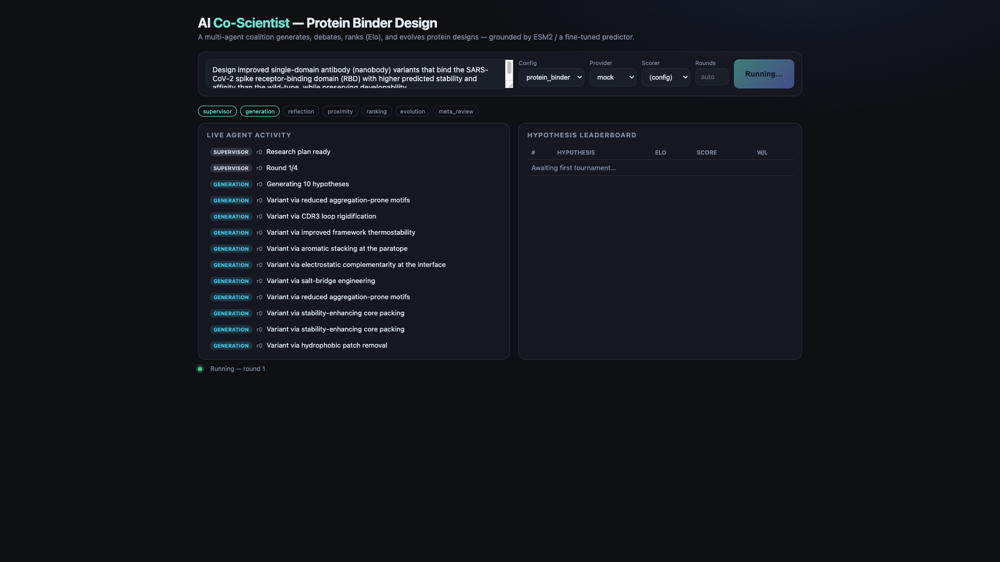
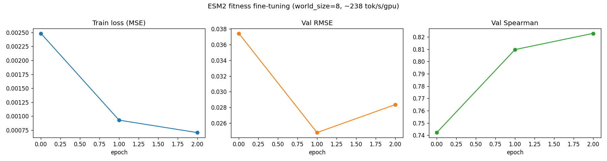

# AI Co-Scientist — Multi-Agent Protein Binder Design

> A from-scratch, open-source reimplementation of the multi-agent scientific-discovery
> systems from two *Nature* papers — Google's [AI co-scientist](https://www.nature.com/articles/s41586-026-10644-y)
> and Stanford's [Virtual Lab](https://www.nature.com/articles/s41586-025-09442-9) —
> specialized for **protein binder design** and grounded in **real ML scores**, including a
> protein-fitness predictor you fine-tune across **multiple GPUs**.

You give it a natural-language **research goal** (e.g. *"design improved nanobody binders for
the SARS-CoV-2 spike RBD"*). A coalition of specialized LLM agents then **generates, peer-reviews,
ranks (via an Elo tournament), and evolves** candidate protein sequences over many rounds —
with the tournament grounded in objective scores from ESM2 and a model *you* trained — and emits
a final ranked design list plus a research overview.

<p align="center">
  
</p>

<p align="center"></p>

<p align="center"><em>Live view of one round: the goal flows through the agent coalition while protein scores feed the Elo tournament.</em></p>

## Why this project

It deliberately demonstrates four hard skills in one coherent system:

| Skill | Where it lives |
| --- | --- |
| **Multi-agent orchestration** | 6 specialized agents + a Supervisor + an Elo "tournament of ideas" (`coscientist/agents`, `coscientist/core`) |
| **Long-horizon reasoning** | Durable, resumable, multi-round generate→critique→score→rank→evolve loop with SQLite-persisted memory across hundreds of LLM calls (`coscientist/core/supervisor.py`, `store.py`) |
| **Multi-GPU training** | DDP/FSDP fine-tuning of an ESM2 protein-fitness predictor with throughput + scaling logging (`training/`) |
| **Protein / bio** | Sequence design scored by ESM2 pseudo-log-likelihood and your fine-tuned predictor (`coscientist/protein/`) |

It is **always runnable**: with no AWS and no GPU it falls back to a deterministic mock LLM and a
CPU heuristic scorer, so `pytest` and the full UI work offline. Add Bedrock for real agents; add a
GPU for real protein scores; add your trained checkpoint to ground the tournament in your own model.

## Three-layer architecture

<p align="center"></p>

<p align="center"><em>Live view of one round: the goal flows through the agent coalition while protein scores feed the Elo tournament.</em></p>



### The agent coalition (Layer 1)
- **Supervisor** — parses the goal into a plan and runs the async, bounded-concurrency round loop.
- **Generation** — proposes diverse, mechanistically-grounded candidate sequences/mutations.
- **Reflection** — virtual peer review: scores correctness, novelty, testability, safety.
- **Proximity** — embeds + clusters candidates to deduplicate and seed informative pairings.
- **Ranking** — Elo tournament from pairwise *simulated debates*, **blended with objective protein scores**.
- **Evolution** — refines / combines / simplifies / reimagines the top candidates each round.
- **Meta-review** — synthesizes the tournament into a research overview + proposed wet-lab experiments.

### Protein scoring (Layer 2) and your trained predictor (Layer 3)
Agents score sequences through one `Scorer` interface with graceful degradation:
`predictor` (your fine-tuned ESM2 head) → `esm` (ESM2 PLL) → `heuristic` (numpy-only CPU fallback).

## Quickstart

```bash
git clone <this-repo> && cd ai-coscientist
python -m venv .venv && source .venv/bin/activate   # Python 3.11+
pip install -r requirements.txt
```

### 1. Run fully offline (no AWS, no GPU)

The mock provider + heuristic scorer make the whole pipeline run deterministically:

```bash
COSCIENTIST_LLM_PROVIDER=mock coscientist run \
  "Design improved nanobody binders for SARS-CoV-2 RBD" \
  --config protein_binder --scorer heuristic
```

You'll see a live Elo leaderboard in the terminal and an `overview.md` written to
`data/artifacts/<session>/final/`.

### 2. Run with real Bedrock Claude agents

```bash
cp .env.example .env   # set AWS_REGION and model ids
export COSCIENTIST_LLM_PROVIDER=bedrock
coscientist run "..." --config protein_binder
```

Requires `bedrock:InvokeModel` permission and Claude **model access enabled** in your region
(Bedrock console → *Model access*). See [Bedrock setup](#bedrock-setup).

#### Live Bedrock demo (measured)

A full 2-round `protein_binder` session was run end-to-end on **AWS Bedrock** with the ESM2
pseudo-log-likelihood scorer. Real measured cost for the run:

| Metric | Value |
| --- | --- |
| Model | Claude **Haiku 4.5** (`us.anthropic.claude-haiku-4-5-20251001-v1:0`) |
| LLM calls | 23 |
| Tokens (in / out) | 13,180 / 28,343 |
| Approx. cost | **~$0.12** |
| Rounds | 2 |

> **Note on frontier models / guardrails.** Anthropic's frontier Claude models on Bedrock
> (Opus 4.7, Opus 4.8, Sonnet 4.6) apply a biosecurity guardrail that returns
> `stopReason=content_filtered` on protein-variant *design* prompts, so they cannot drive this
> pipeline's generation/evolution agents. Haiku 4.5 is unaffected and is the default for live runs.
> The Bedrock client tolerates filtered/empty/truncated responses (see `coscientist/llm/`).

### 3. Launch the web UI

```bash
coscientist serve            # then open http://127.0.0.1:8000
```

<p align="center">
  
  
</p>

The UI streams every agent action over a websocket, shows a live-updating Elo leaderboard with
protein scores, and renders the final research overview.

## Multi-GPU training (the differentiator)

Fine-tune ESM2 into a protein-fitness predictor and plug it in as the agents' scorer. Full details
in [`training/README.md`](training/README.md).

```bash
pip install -r requirements-protein.txt

# Single process smoke test (CPU/1 GPU, synthetic data, no downloads):
python -m training.train --dataset synthetic --epochs 1 --max-train 256

# Multi-GPU on a g5.12xlarge (4x A10G):
./training/launch_multi_gpu.sh 4 ddp  facebook/esm2_t12_35M_UR50D   # DDP
./training/launch_multi_gpu.sh 4 fsdp facebook/esm2_t33_650M_UR50D  # FSDP (sharded)

# Plot curves, then ground the agents in your model:
python -m training.plot_curves
export COSCIENTIST_SCORER=predictor COSCIENTIST_PREDICTOR_CKPT=checkpoints/esm2_fitness
coscientist run --config protein_binder
```

Training logs **tokens/sec/GPU**, `world_size`, loss, and val RMSE/Spearman to `metrics.json`,
checkpoints each epoch, and supports `--resume`. To run on AWS within the credit budget, see
[`scripts/aws_train.md`](scripts/aws_train.md).

<p align="center">
  
</p>

**Measured multi-GPU run** (real, on AWS `g5.48xlarge` = **8× NVIDIA A10G**, 23 GB each):

| Setting | Value |
| --- | --- |
| Hardware | 8× NVIDIA A10G (`g5.48xlarge`), `world_size=8` |
| Base model | `facebook/esm2_t33_650M_UR50D` (650M params) |
| Strategy | DDP (DistributedDataParallel) |
| Dataset / epochs / batch | synthetic · 3 epochs · batch size 16/GPU |
| Throughput | ~238–262 tokens/sec/GPU (~154 s/epoch; full run 525 s) |
| Val RMSE | 0.0374 → 0.0248 → **0.0284** (epoch 0→1→2) |
| Val Spearman | 0.742 → 0.810 → **0.823** (best 0.8229) |

All numbers above are read verbatim from `checkpoints/esm2_fitness/metrics.json` /
`train.log`. The training curves below are generated from that same run. Swap in a real
FLIP/SKEMPI split (and FSDP for even larger ESM2 backbones) for a full scientific showcase.*

## Project layout

```
coscientist/
  agents/      generation, reflection, proximity, ranking, evolution, meta_review, supervisor
  core/        models (pydantic), store (SQLite), tournament (Elo), supervisor (async loop), context
  llm/         provider interface, Bedrock (converse/converse_stream), mock provider, prompt templating
  protein/     Scorer interface, ESM2 PLL scorer, fine-tuned predictor scorer, heuristic fallback
  prompts/     per-agent Jinja2 prompt templates
  config/      default.yaml + protein_binder.yaml presets
  cli.py       `coscientist run | serve | sessions`
training/      multi-GPU DDP/FSDP fine-tuning (train, model, data, eval, plot, launch script)
server/        FastAPI websocket backend + single-file React UI
tests/         Elo / store / proximity / LLM / mocked end-to-end
```

## Bedrock setup

1. Grant the calling IAM identity `bedrock:InvokeModel` and `bedrock:InvokeModelWithResponseStream`.
2. In the **Bedrock console → Model access** (per region), enable the Anthropic Claude models.
3. Set the model ids in `.env` (`COSCIENTIST_MODEL_STRONG`, `COSCIENTIST_MODEL_FAST`).

Cost is dominated by cheap text inference; a full demo run is a few cents to a few dollars. The
client tracks token usage and an approximate USD cost (shown in the CLI/UI footer).

## Testing

```bash
COSCIENTIST_LLM_PROVIDER=mock pytest -q
```

The suite covers the Elo math, the SQLite store, proximity embeddings, JSON/LLM parsing, and a
**mocked end-to-end run** — no AWS or GPU required, so it's CI-friendly.

## Design notes & honest scope

- **Graceful degradation is intentional**: the engine never hard-requires a GPU, a checkpoint, or
  AWS. This keeps the repo runnable for everyone and keeps GPU quota off the critical path.
- **The heuristic scorer is a transparent proxy**, not biophysically accurate — it exists so the
  tournament runs without torch. Real signal comes from `esm`/`predictor`.
- **"Literature grounding"** uses the LLM's parametric knowledge by default; a web-search/PubMed
  tool hook is a natural extension behind the same agent interface.
- **Structure prediction** (ColabFold pLDDT) is sketched as an optional Layer-2 scorer; it's off by
  default to avoid heavy dependencies.

## Citations

- Google DeepMind et al., *Towards an AI co-scientist*, **Nature** (2026). https://www.nature.com/articles/s41586-026-10644-y
- Swanson, Wu, et al., *The Virtual Lab of AI agents designs new SARS-CoV-2 nanobodies*, **Nature** (2025). https://www.nature.com/articles/s41586-025-09442-9
- Lin et al., *Evolutionary-scale prediction of atomic-level protein structure with a language model (ESM2)*, **Science** (2023).

## License

MIT — see [LICENSE](LICENSE).
